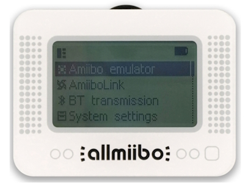
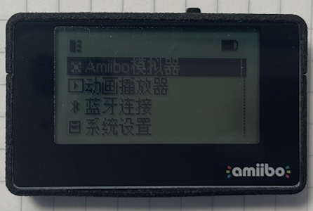
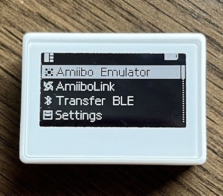
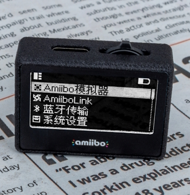

# Disney Infinity on Allmiibo (Unofficial Support)

## Overview 

**Allmiibo** is an NFC emulation device originally designed for emulating Amiibo figures. Support for **Disney infinity** was later introduced, enabling users to simulate Disney figures by uploading NFC dumps to the Allmiibo device and having it emulate them.

## How to Determine Your Model (LCD or OLED) :

If you're trying to figure out whether your device has an LCD or OLED screen, here's a quick way to tell:

**LCD** screens have a **whitish** background.

**OLED** screens have a **black** background.

## How to Flash the New Custom Firmware :

There are **two simple ways** to update the firmware on your **Allmiibo** device:

- **Using a Computer:** Connect to the Allmiibo device via Bluetooth using a computer equipped with a Bluetooth adapter.
- **Using an Android Phone:** Use the "**[MTools BLE - BLE RFID Reader](https://play.google.com/store/apps/details?id=com.mtoolstec.mtoolsLite)**" app to connect to Allmiibo.

### Using a Computer :

1. For Disney, to make them compatible we use a firmware 2.13.0 or newer.
- You can get the latest version here: **[https://github.com/solosky/pixl.js/releases](https://github.com/solosky/pixl.js/releases)**.
2. Download the **appropriate** firmware (**LCD** or **OLED**) based on your device.
3. **Extract** the downloaded ZIP file, and inside **you’ll find another archive** named "**pixjs_ota_vX.zip**". This is the file you'll need.
4. Ensure that **Bluetooth** is **enabled** on your computer/laptop.
5. Open **Google Chrome** and navigate to **[https://pixl.amiibo.xyz/](https://pixl.amiibo.xyz/)**.
- Other browsers may **not** support **[Bluetooth](https://caniuse.com/web-bluetooth)** connections for this process.
- Also if the above link doesn’t work, use this backup link: **[Backup pixl.amiibo.xyz](https://skylandersnfc.github.io/Docs/Skylanders_on_Allmiibo/pixl.amiibo.xyz/)**
6. Press the **upper button** on your **Allmiibo** device to navigate to the "**BLE File Transfer**" menu.
- You should see a MAC address and the website address: **[https://pixl.amiibo.xyz/](https://pixl.amiibo.xyz/)**.
7. Click on the **[Connect]** button and **pair** your **Allmiibo** device.
8. Once connected, a **green** bubble will appear on the right, showing your **current firmware version**.
9. Click the **[Refresh]** button and open your "**E:/ [External Flash]**" storage. This **confirms** that you are **connected**.
  - If you see a "**chameleon**" folder - **DELETE IT**. It will be recreated by the new custom firmware.
10. Click the gray **[DFU]** button. It will prompt you to enter DFU mode.
- Click **Yes** to proceed and let it open the **DFU** upgrade page **[Web Bluetooth Secure DFU](https://thegecko.github.io/web-bluetooth-dfu/examples/web.html)**.
- If this page is not working, we also have a backup of it: **[Backup Web Bluetooth Secure DFU](https://skylandersnfc.github.io/Docs/Skylanders_on_Allmiibo/web-bluetooth-dfu/examples/web.html)**
11. The new page will ask you to select the firmware package.
- Select the **pixjs_ota_vXXX.zip** file you prepared earlier.
- Be mindful of time, as the Allmiibo device may turn off if you take too long, requiring you to repeat steps 5-9.
12. Wait for the process to **complete** and **don't do anything stupid**.
13. **That's it!** Your **firmware** is now **updated**.

### Using an Android Phone :

1. Download the "**[MTools BLE - BLE RFID Reader](https://play.google.com/store/apps/details?id=com.mtoolstec.mtoolsLite)**" app.
2. Go to the "**Pixl.js Amiibo**" menu and click on "**Pixl.js (Click to connect)**" at the top.
3. Press the **upper button** on your **Allmiibo** device to navigate to the "**BLE File Transfer**" menu.
- You should see a MAC address and the website address: **[https://pixl.amiibo.xyz/](https://pixl.amiibo.xyz/)**.
4. **Pair** the **Allmiibo** device with your **phone**.
5. Check the "**File**" menu on the bottom left.
- If you see a "**chameleon**" folder - **DELETE IT**. It will be recreated by the new custom firmware.
6. Go to "**Firmware**" menu on the bottom right.
7. You can get the latest firmware from here: **[https://github.com/solosky/pixl.js/releases](https://github.com/solosky/pixl.js/releases)**.
- Download the **appropriate** firmware (**LCD** or **OLED**) based on your device.
8. On "**(1) File**" select the correct firmware file which you have just downloaded.
9. On "**(2) Device**" make sure your device is **connected** and **selected**.
10. On "**(3) Progress**" click "**Start**" to flash the new firmware and **don't do anything stupid**.
11. **That's it!** Your **firmware** is now **updated**.

## How to Upload Disney NFC Dumps :

You can do this via the **[https://pixl.amiibo.xyz/](https://pixl.amiibo.xyz/)** website using a computer or laptop with Bluetooth, or by using the **[MTools BLE - BLE RFID Reader](https://play.google.com/store/apps/details?id=com.mtoolstec.mtoolsLite)** app.
I’ll focus on the website method, as the app is relatively straightforward.

1. On your Allmiibo device, navigate to the "**Card Emulation**" menu.
- If it's your first time accessing this menu, it may take a while to initialize.
- The device will also create a "chameleon" folder with two subfolders: "dumps" and "slots".
2. Return to the main menu and select the "**BLE File Transfer**" option.
3. Open **[https://pixl.amiibo.xyz/](https://pixl.amiibo.xyz/)** and connect it to your **Allmiibo** device.
4. Click the "**Refresh**" button, and you should see "**E:/ [External Flash]**" storage appear.
5. Inside this storage, locate the "**chameleon**" folder and its "**dumps**" subfolder.
- These were automatically created in Step 1 when the "**Card Emulatio**" menu was initialized.
- If you skipped Step 1, you can manually create these folders.
6. In the "**chameleon/dumps**" folder, click the blue "**Upload**" button.
7. Select the **desired dumps** from the **[Infinity Ultimate NFC Pack](https://skylandersnfc.github.io/Disney-Infinity-NFC/Infinity_Ultimate_NFC_Pack/)**.
- You can upload multiple dumps, but avoid uploading more than 20 at once or having too many dumps in this directory.
8. The upload popup window can be a bit tricky.
- Wait for all the dumps to upload, indicated by a green check mark on the right.
9. Once complete, close the window.
- You’ll get a **warning** message, simply confirm by clicking **OK**.
10. All your uploaded dumps should now appear in the "**chameleon/dumps**" folder.

## How to Emulate Disney NFC Dumps :

1. On your **Allmiibo** device, go to the "**Card Emulator**" menu.
2. Select "**Slot 01**", then go to "**Type**" and make sure "**MiFare Mini**" is the type of this slot.
3. Navigate to "**Data...**", then "**Load...**".
4. Select a Disney dump from the "**chameleon/dumps**" folder and you should see "**Load File Success**".
5. Navigate to "**Advanced...**" and change "**Custome Mode**" from **[OFF]** to **[ON]**.
6. Go one step down to "**Load From Block0...**" and activate it. It should say "**Load Block 0 Success**"
7. Go one more step down to "**ID Size**" and change it from **4 Bytes** to **7 Bytes**.
8. That's it! You don’t need to adjust anything else. Simply return to "**[Tag Details]**" menu.
9. You should now see your Disney Infinity Figure's name followed by "**.bin**".
- This is the emulation screen, and your Allmiibo device will now emulate the selected Infinity figure.
- To use a different figure, select a different slot and repeat the steps.
10. Place your **Allmiibo** device on the **Infinity Base** to bring the selected Disney Figure into the game.

## Where To Buy Allmiibo :

Here are some **Allmiibo** links from **AliExpress** :

[https://www.aliexpress.com/item/1005006214951877.html](https://www.aliexpress.com/item/1005006214951877.html)

[https://www.aliexpress.com/item/1005006260883608.html](https://www.aliexpress.com/item/1005006260883608.html)

Also check : **[Pixl.js buyer guide](https://github.com/solosky/pixl.js/issues/213)**

## Notes :

Do **not** use more than **1.5 MB** of the device’s total 1.83 MB capacity.
Exceeding this limit may lead to hard bricking of the microcontroller, causing constant freezing on startup, among other issues.
Additionally, the device may slow down if you store too many small files.

Guidelines:

- Avoid placing **too many files** in the same directory.
- Use **short file and directory names** to ensure the full file path does not exceed 64 characters.
